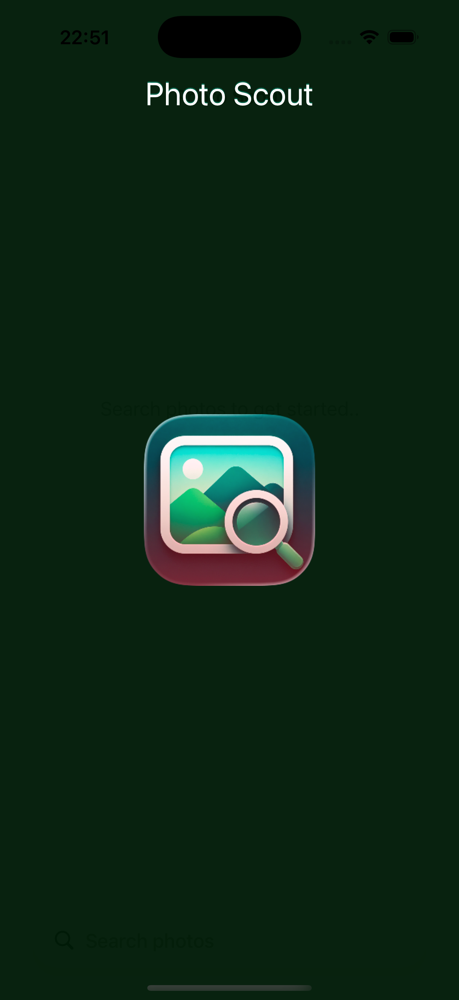
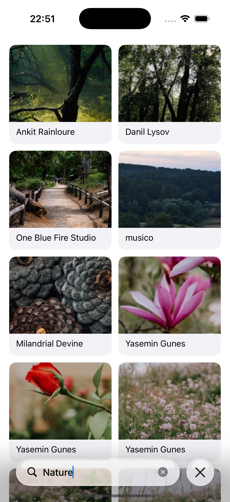

# Photo Scout

PhotoScout is an iOS application built with UIKit and RxSwift that allows users to search photos using the [Pexels](https://www.pexels.com/api/documentation/#guidelines) API and preview selected images in a detail screen.

## Screenshots

<p align="center"><strong>Launch Screen</strong></p>
<p align="center">
  
</p>

<p align="center"><strong>Search Screen</strong></p>
<p align="center">
  
</p>

<p align="center"><strong>Detail Screen</strong></p>
<p align="center">
  
</p>

## Features

- Search photos by keyword
- Display results in a two-column grid layout
- Show loading and empty/error states
- Open selected photo in a detail preview screen
- Load remote images asynchronously

## Tech Stack

- UIKit
- RxSwift / RxCocoa
- MVVM
- Feature-based folder structure
- Compositional Layout
- Swift Testing for unit tests

## Project Structure

```text
PhotoScout/
├── App/
├── Core/
├── Debug/
├── Features/
│   ├── Search/
│   └── PhotoDetail/
├── Shared/
└── Resources/
```

## Architecture

- This project uses a feature-based MVVM structure.

## Notes

- Main.storyboard is used as the application entry point
- Dependencies are managed through AppDependencyContainer
- Search feature uses debounce to avoid unnecessary API calls while typing

## Future Improvements

- Pagination support
- UI enhancements with Better empty state UI
- Other necessary improvements
